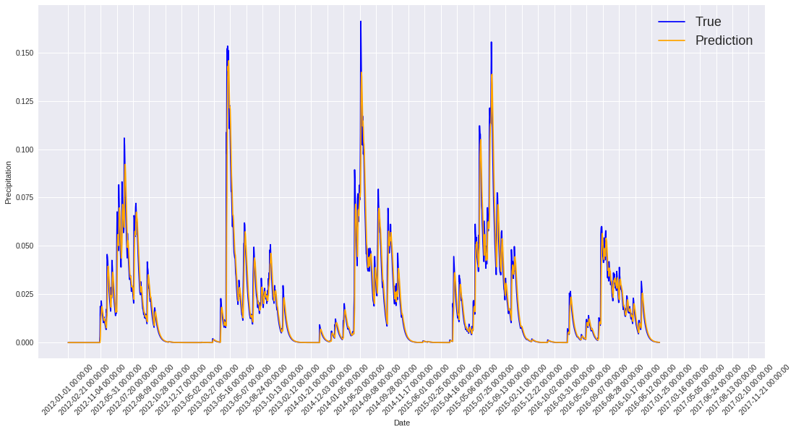
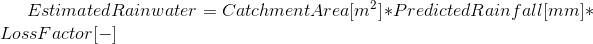
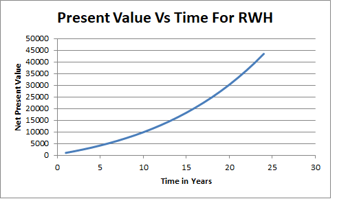
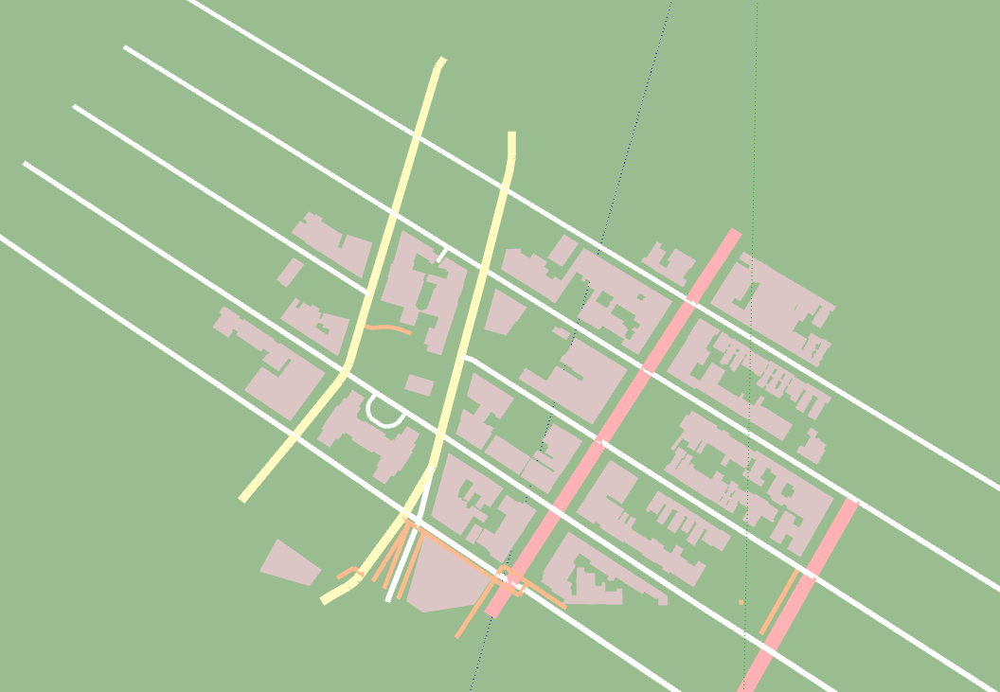
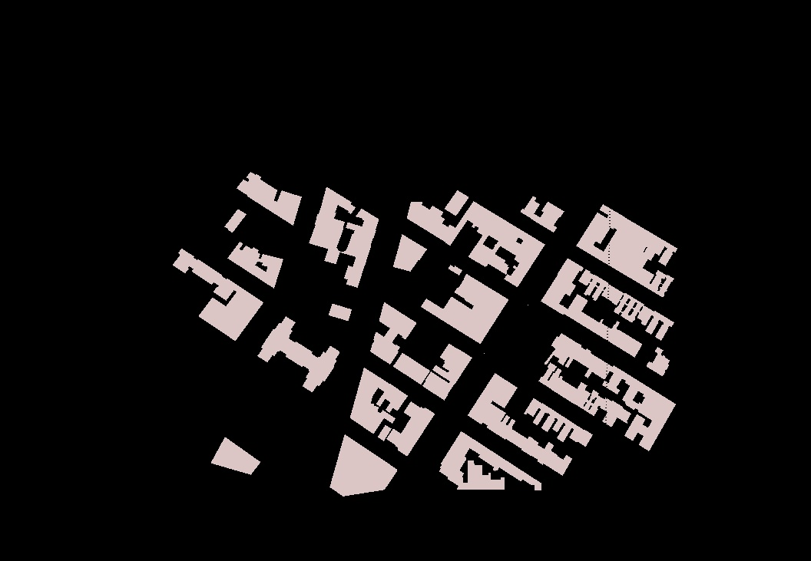
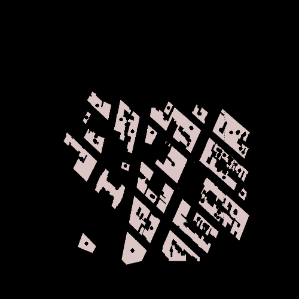

# SIH2019 - Shared Rooftop Rainwater Harvesting
Smart India Hackathon - 2019

## PROBLEM and MOTIVATION
Currently, for roof top rain water harvesting, people install water storage tanks personally for their building/apartment which results in high cost for each of these individual/group. We tried to solve this problem by building a housing level rainwater harvesting system. The motivation and sustainence of the solution is extensively mentioned in *Our_Approach.docx* document in the resources folder.

## APPROACH
We approached the problem at different levels and tried to solve in this to yield a complete and sustainable solution. 
- Estimating rainwater harvesting capacity
	- Rainfall prediction using historical data 
	- Catchment area estimation
- Optimizing water tank placement
	- Calculate water demand/use capacity for the area
	- Analysing underground map
- Distribtion and Cost-Benefit Analysis
	- Laying out plan for underground tanks with input and output points defined
	- Cost benefit analysis to justify the plan
- Plan for cost incurment of cost for the parties involved

The complete solution is presented in the form of an end to end web application integrated solution, where given an image of the area of interest for setting up the rain water harvesting system and given some historical rainfall data for the area, we can very well estimate the performance of the model at the place.

### Rainfall Prediction
For rainfall prediction, we use daily historical rainfall data to train our LSTM model, as it can very well preserve the long term dependencies and relationships given it's architecture. 

**Tools/Resources Used:** Python 3 ( pandas, numpy, keras etc.). 

**Result:** It estimates amount of rainfall for the next time period given (in *mm* of rainfall)

### Catchment Area Estimation
Operating to solve the problem for a housing society, we just considered rainwater from rooftops for the estimation. Given the map input in the web application, we estimate the catchment area by segmenting the image by canny edge detection. Given the area coverage of the map, we estimate the area of rooftops and hence we get the amount of water we are going to get by

### Cost benefit analysis to justify the plan
The capital cost is invested by the shareholders. The maintainance and the operational cost is divided amongst the beneficiaries *based on their demand of water*. It is calculated using YAS algorithm. YAS algorithm is also used to find the break even point for our rainwater harvesting model. The script is present in Reservoir Optimization folder. 

### Calculating water demand
We can get the water demand of the area from the responsible water supply body. Here we collect the timely demands of water from various households through the web application. The user logs in to check his/her use and place a demand of water for the next time period. The payment for the service is distributed into various households, proportional to their demand/use. 

### Water tank placement and optimization of tank capacity
Optimality of water tank placement is determined by clustering of the colour filtered and segmented greyscale image of the map provided. This is done to reduce the pipe laying out cost for collection and distribution of water. While placing the tank, we consider the underground map (consisting of various piping systems, electricity lines etc. ) and construct the tank nearest plausible area to the cluster centers found. 

**2D PLOT projection**

**Building Contours**

 

**Centroids of Catchment Area (Building)**

### Plan for cost incurment of cost for the parties involved
- Who will invest (Upfront Capital Investment) 
    - Real Estate Companies in their housing project, or
    - Municipality

- How to sustain (Maintenance Cost)
    - Recovered from user/households in the form of monthly rental /society maintenance charge. 

### Web Application Development
Web Application is developed using Django framework in python. The web application two authority level - Admin and User.
Admin has access to all the development and application rights like getting the optimum values for the tank placements, rainwater prediction, catchment area estimation, cost benefit analysis and estimated break even points. 
.png)
